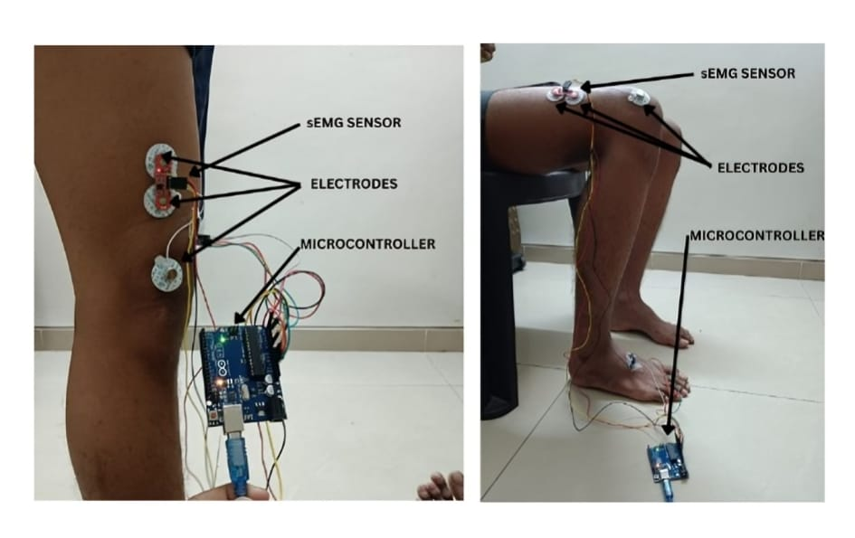
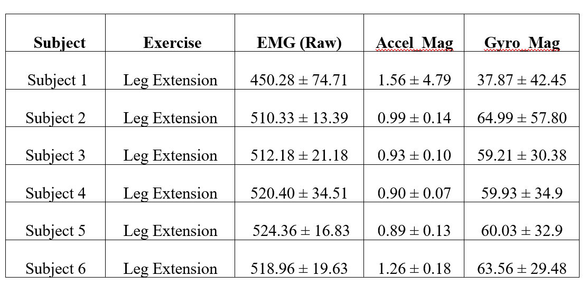
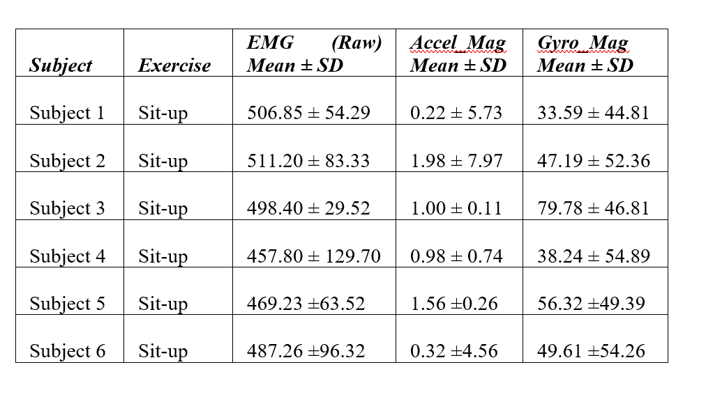

# Wearable sEMG + IMU System 🧠

## 📌 Overview
A wearable system designed to analyze muscle activity and body motion using sEMG sensors and IMU for motion disorder detection.

## 🛠️ Technologies Used
- sEMG Sensors
- IMU (Accelerometer + Gyroscope)
- Signal Processing (Python)

## ⚙️ Features
- Captures muscle activity signals
- Tracks limb movement
- Identifies motion patterns

## 🔄 How It Works
Sensors collect neuromuscular + motion data → signals processed using filtering & RMS → patterns analyzed.

## 📸 Project Demo

### 🔧 Hardware Setup

### 📱 Readings

## ⚡ Future Improvements
- Machine learning for classification
- Wireless data transmission
- Real-time mobile visualization

## 🧠 Learning Outcomes
- Biomedical signal processing
- Sensor data analysis
- Embedded system design

## 👨‍💻 Author
Kishore Kanna P
